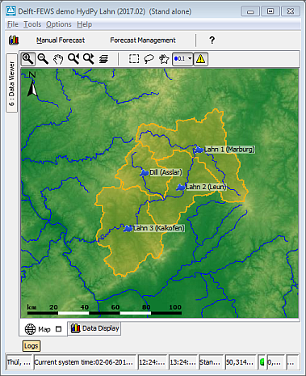

# Delft-FEWS HydPy-Lahn

A Delft-FEWS sample configuration for applying [HydPy-H](https://hydpy-dev.github.io/hydpy/HydPy-H.html) (HBV96) to the river Lahn.

This demo of linking Delft-FEWS to HydPy results from a project of the German [Federal Institute of Hydrology](http://www.bafg.de) (BfG). The BfG also provides meteorological data and catchment geodata as a courtesy.

The German River Lahn is a tributary to the Rhine. The following map shows the spatial configuration of the HydPy-H model. It consists of four subcatchments, each one with a river gauge (Marburg, Asslar, Leun, Kalkofen) at its outlet.

## Getting started
Prerequisites:
* Install the [HydPy framework](https://github.com/hydpy-dev/hydpy).  Follow the general [installation instructions](https://hydpy-dev.github.io/hydpy/install.html) and additionally install the [netCDF4](http://unidata.github.io/netcdf4-python/) and [lxml](https://lxml.de/) interfaces, required for reading and writing
  NetCDF-CF time series files and validating XML configuration files.
* Install a Java Runtime Environment (JRE) or Java Development Kit (JDK) suitable for Delft-FEWS 2017.01 (e.g. version 1.8), preferably 64 bits. 
* Download [Delft-FEWS 2017.01](https://oss.deltares.nl/web/delft-fews/download). 
* Get the demo data.

Setup ([typical setup of a Delft-FEWS instance](https://publicwiki.deltares.nl/display/FEWSDOC/03+Creating+a+FEWS+Application+Directory)):
* copy the demo data to your file system
* adapt the file `global.properties` to your local conditions:
  * `PYTHON_PATH`: path pointing to your local Python installation
* add the Delft-FEWS binaries to the directory Delft-FEWS_HydPy-Lahn/bin
* copy the appropriate Delft-FEWS launcher EXE from bin/launcher/<OS/Java>/ to Delft-FEWS_HydPy-Lahn and rename it according to the INI file to be used (respect the installed Java version 32B vs. 64B)
* adapt the INI file (_`FewsDemo_HydPy_Lahn_xVV.ini`)  
  * `vm.location`: path pointing to the Java installation to be used
  * further adaptions if wanted or needed
* to add a river network to the map display, you can download the European river network with 30sec resolution in the ESRI shapefile format (eu_riv_30s.zip) from [HydroSHEDS](https://www.hydrosheds.org) (you need to register and accept a license). Unzip and copy it to the Delft-FEWS MapLayerFiles folder (Delft-FEWS_HydPy-Lahn/FewsDemo_HydPy-Lahn/Config/MapLayerFiles). 

## Configuration overview
* the importable time series data are provided in `ImportBackup` (01/01/2008 - 31/12/2012) 
* the available workflows are importTimeSeries, runUpdateLahnH and runForecastLahnH 
* the macro DemoLahnH bundles the workflows

## Run the provided HydPy model via Delft-FEWS
* set the `Current system time` in Delft-FEWS  to match the timeline of the sample time series (01/01/2008 - 31/12/2012) 
* copy the time series data from `ImportBackup` to `Import`
* execute the provided workflows: importTimeSeries, runUpdateLahnH and runForecastLahnH. Don't forget to approve the forecast after running runUpdateLahnH and runForecastLahnH.
* explore the data...  