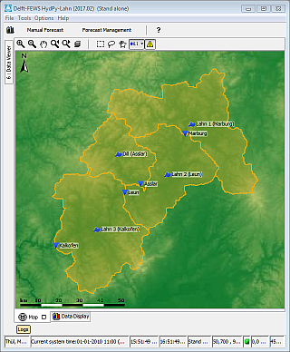

# Delft-FEWS HydPy-Lahn

Delft-FEWS sample configuration for a HydPy model for some catchments of the river Lahn in Germany.

This demo of linking Delft-FEWS to HydPy results from a project of the German [Federal Institute of Hydrology](http://www.bafg.de) (BfG). BfG also provides meteo data and geo data as a courtesy.

## Getting started
Prerequisites:
* install [Python](https://www.python.org/). Currently the version 3.6 suits best the needs of HydPy. 
  * additionally add lxml, netCDF4 and matplotlib to your Python installation by executing the following from the command line: 
    * pip install lxml 
    * pip install netCDF4
    * pip install matplotlib 
  * install the [HydPy framework](https://github.com/hydpy-dev/hydpy) itself: 
    * pip install hydpy    
* install a Java Runtime Environment (JRE) or Java Development Kit (JDK) suitable for Delft-FEWS 2017.01 (e.g. version 1.8), preferably 64 bits 
* get [Delft-FEWS 2017.01](https://oss.deltares.nl/web/delft-fews/download) 
* get these demo data

Setup ([typical setup of a Delft-FEWS instance](https://publicwiki.deltares.nl/display/FEWSDOC/03+Creating+a+FEWS+Application+Directory)):
* copy these demo data to your file system
* adapt the file `global.properties` to your local conditions:
  * `PYTHON_PATH`: path pointing to your local Python installation
* add the Delft-FEWS binaries to the directory Delft-FEWS_HydPy-Lahn/bin
* copy the appropriate Delft-FEWS launcher EXE from bin/launcher/<OS/Java>/ to Delft-FEWS_HydPy-Lahn and rename it according to the INI file to be used (respect the installed Java version 32B vs. 64B)
* adapt the INI file (_`FewsDemo_HydPy_Lahn_xVV.ini`)  
  * `vm.location`: path pointing to Java installation to be used
  * further adaptions if wanted or needed
* to add a river network to the map display, you can download the European river network with 30sec resolution in ESRI shape file format (eu_riv_30s.zip) from [HydroSHEDS](https://www.hydrosheds.org) (you need to register and accept a license). Unzip and copy it to the Delft-FEWS MapLayerFiles folder (Delft-FEWS_HydPy-Lahn/FewsDemo_HydPy-Lahn/Config/MapLayerFiles). 

## Configuration overview
* time series data for import are provided in `ImportBackup` (01/01/2008 - 31/12/2012) 
* available work flows are importTimeSeries, runUpdateLahnH and runForecastLahnH 
* macro DemoLahnH bundles the work flows

## Run the provided HydPy model via Delft-FEWS
* set current system time to match the time line of the sample time series (01/01/2008 - 31/12/2012) 
* copy time series data from `ImportBackup` to `Import`
* execute the provided work flows: importTimeSeries, runUpdateLahnH and runForecastLahnH, don't forget to approve the forecast after running runUpdateLahnH and runForecastLahnH.
* explore the data...  